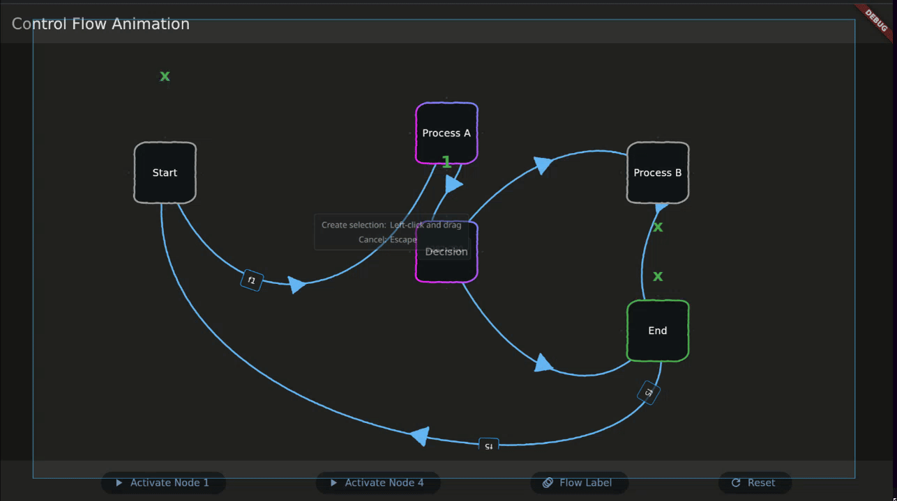

# Paper Graph

Animated control-flow graph visualization for Flutter. Nodes process data packets that travel along bezier-curved edges as animated labels, with configurable routing, side-effect hooks, and optional hand-drawn rendering.



## Quick Start

```bash
flutter pub get
flutter run
```

The app starts an HTTP event server on port 4242 and launches the graph visualization. Select a graph from the dropdown in the top bar.

## Building Graphs

Graphs are built with a fluent `GraphBuilder` API. Processors are pure routing functions that return a `RouteDecision`; the `GraphRouter` handles edge lookup and event emission. Side effects (UI overlays, floating text) are separated into `ProcessInterceptor` hooks.

```dart
ControlFlowGraph myGraph(GraphRouter router, FnNodeStateCallback onUpdateNodeState,
    FnContextFetcher fnGetBuildContext, VoidCallback onEnd) {
  final builder = GraphBuilder()
    ..startAt('a')
    ..properties(isAutomatic: true, hasEnd: true)
    ..edge('a', 'b', label: 'go', curveBend: -100)
    ..edge('b', 'a', label: 'back', curveBend: 100)
    ..node<String, String>('a', position: Offset(0.2, 0.5), title: "Start",
      processor: (packet, router) async {
        await Future.delayed(router.processingDuration);
        return RouteDecision.toNode(toNodeId: 'b', label: "hello");
      })
    ..node<String, String>('b', position: Offset(0.8, 0.5), title: "End",
      processor: (packet, router) async {
        onEnd();
        return RouteDecision.terminal();
      });
  return builder.build(router: router, onUpdateNodeState: onUpdateNodeState);
}
```

Register the graph in the `KnownGraph` enum in `lib/models/knowngraphs/known.dart` and add its case to the `loadGraph()` switch.

## Included Graphs

| Graph | Description |
|-------|-------------|
| Racers | Random walk through 5 nodes in an endless loop |
| OAuth Flow (user perspective) | Sequential auth flow with login and permission overlays |
| OAuth Flow (access token) | Token acquisition with conditional routing |
| ACR (Addon Component Runner) | Hypervisor dispatches to worker pools with load balancing |
| New Graph | Blank canvas with a UUID. Supports dynamic node/edge addition via UI buttons or HTTP. |

## Dynamic Graphs

Graphs are observable (`ChangeNotifier`). Nodes and edges can be added or removed at runtime and the UI updates automatically.

### Programmatic API

Use `GraphMutationController` to add nodes with built-in routing strategies:

```dart
final controller = GraphMutationController(graph: graph, router: router, onUpdateNodeState: callback);

// Add a node with auto-positioning and forward routing
controller.upsertDynamicNode(title: 'My Node');

// Add a node with explicit position and broadcast routing
controller.upsertDynamicNode(title: 'Hub', position: Offset(0.5, 0.3), strategy: DynamicRoutingStrategy.broadcast);

// Add a directed node that always routes to a specific target
controller.upsertDynamicNode(title: 'Router', strategy: DynamicRoutingStrategy.directed, directedTargetNodeId: 'target');

// Add an edge
controller.addDynamicEdge(fromNodeId: 'start', toNodeId: 'dyn_node_0');

// Remove
controller.removeNode('dyn_node_0');
controller.removeEdge('dyn_0_start_to_dyn_node_0');
```

### Routing Strategies

Dynamic nodes use one of four strategies (since custom processor code can't be written at runtime):

| Strategy | Behavior |
|----------|----------|
| `forward` | Route along the first enabled outgoing edge (default) |
| `random` | Pick a random enabled outgoing edge |
| `broadcast` | Send data to ALL enabled outgoing edges simultaneously |
| `directed` | Route to a specific edge or node by ID |

### HTTP API

The event server on port 4242 exposes JSON endpoints for graph mutation:

```bash
# Add a node (creates new or updates existing if id matches)
curl -X POST http://localhost:4242/api/v1/graph/nodes \
  -d '{"title": "My Node", "x": 0.3, "y": 0.7}'

# Update a node's state to error
curl -X POST http://localhost:4242/api/v1/graph/nodes \
  -d '{"id": "dyn_node_0", "title": "My Node", "state": "error"}'

# Add an edge
curl -X POST http://localhost:4242/api/v1/graph/edges \
  -d '{"fromNodeId": "start", "toNodeId": "dyn_node_0", "label": "go"}'

# Send data from one node to another (triggers animation + processing)
curl -X POST http://localhost:4242/api/v1/graph/traverse \
  -d '{"fromNodeId": "start", "toNodeId": "dyn_node_0", "label": "hello"}'

# Get current graph state
curl http://localhost:4242/api/v1/graph

# Remove a node (cascades to connected edges)
curl -X DELETE http://localhost:4242/api/v1/graph/nodes/dyn_node_0

# Remove an edge
curl -X DELETE http://localhost:4242/api/v1/graph/edges/dyn_0_start_to_dyn_node_0
```

See the endpoint reference in [Architecture.md](Architecture.md) for full request/response schemas.

## Architecture

See [Architecture.md](Architecture.md) for a detailed system overview.

## Project Structure

```
lib/
  main.dart                      Entry point
  controllers/
    graph_flow_controller.dart   Animation orchestrator (label flow, glow, squish)
    graph_mutation_controller.dart  Dynamic node/edge add/remove with routing strategies
  models/
    graph/                       Core: data model, router, builder, events, interceptors
      dynamic_routing.dart       DynamicRoutingStrategy enum + processor factory
    knowngraphs/                 Predefined graph definitions (+ new_graph.dart for blank canvas)
    config/                      InheritedWidget settings
  painters/                      CustomPainters (edges, hand-drawn rectangles)
  sceens/                        ControlFlowScreen (main graph UI)
  server/                        Shelf HTTP event server with graph mutation endpoints
  src/graph_components/          Node and edge widgets
  widgets/                       Node regions, animated labels, overlays, paper effects
  utils/                         Bezier math, paper drawing utilities
```
